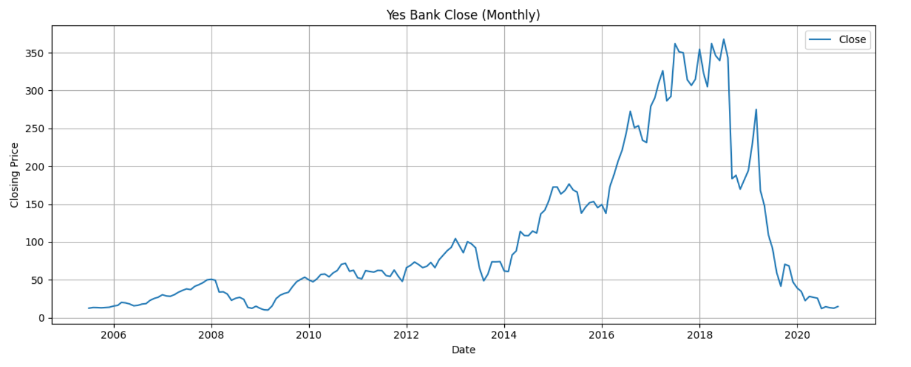
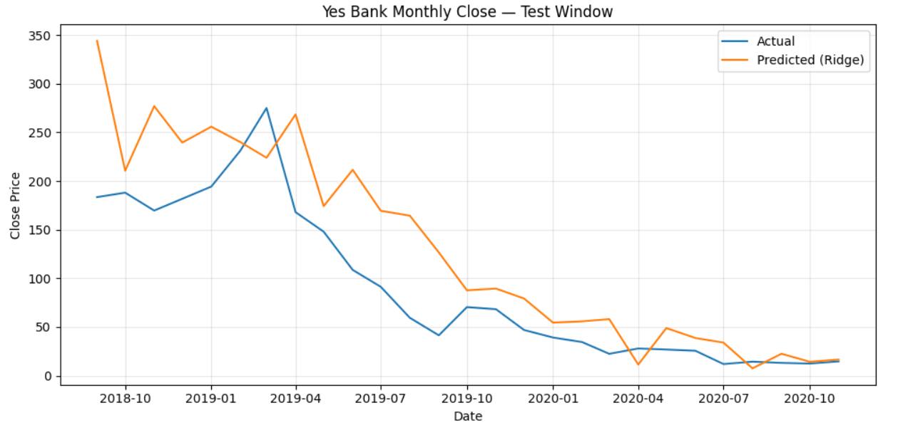
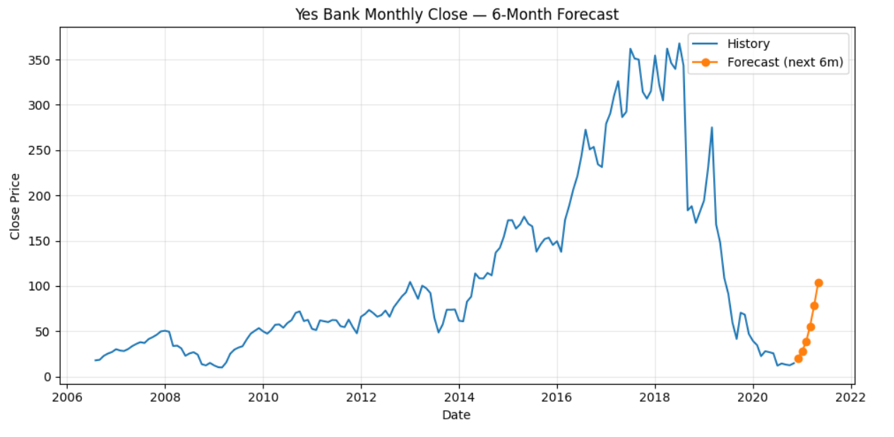

# 📉 Yes Bank Stock Price Prediction (Machine Learning - Time Series)  

📊 **Tools Used**: Python (Pandas, NumPy, Matplotlib, Scikit-learn) | Google Colab  

---

## 📌 Project Overview  
This project predicts the **closing stock price of Yes Bank** using **Machine Learning regression models**.  
The dataset includes historical stock data (OHLC – Open, High, Low, Close), and models are trained to forecast future closing prices.  

The analysis follows a **time-series-aware ML approach** with no data leakage, using **TimeSeriesSplit**.  

---

## 🔑 Key Highlights  
- Feature engineering from OHLC stock data  
- Applied **Ridge Regression** and **Random Forest Regressor**  
- Evaluated using **MAE** and **MSE**  
- Generated a **6-month stock price forecast**  
- Visualized actual vs predicted closing prices  

---

## 📂 Project Files  
- `YesBank_MLproject.ipynb` → Jupyter Notebook with complete ML pipeline  
- 🚫 **Dataset not included** (confidential / not public)  
- 📸 Screenshots of results (see below)  

---

## 📸 Sample Visualizations  

Closing stock price trend:  
  

Predicted vs Actual prices:  
  

Model forecast (next 6 months):  
  

---

## 🚀 How to Run the Project  
1. Open the notebook in **Google Colab** or Jupyter Notebook.  
2. Install required libraries if running locally:  
   ```bash
   pip install pandas numpy matplotlib scikit-learn

---

## 📫 Connect with Me  
- [LinkedIn](https://www.linkedin.com/in/soorya-k-s-/)  
- 📧 Email: **sooryaks552@gmail.com*
---
⭐️ From [Sooryaks237](https://github.com/Sooryaks237)
